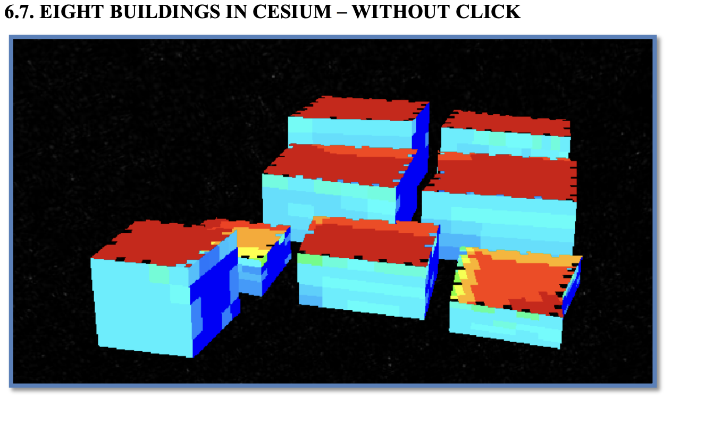
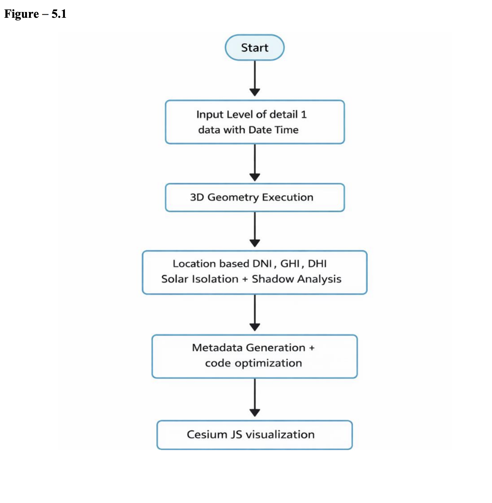
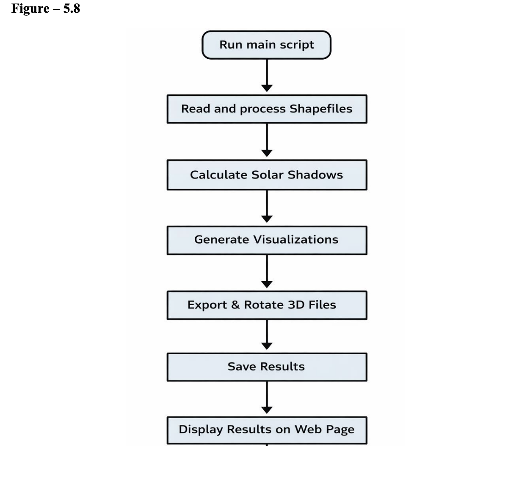
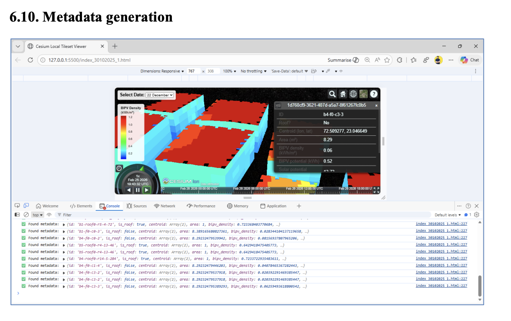

<div align="center">

# 🛰 3D Urban Building Energy Assessment for Building-Integrated Photovoltaics (BIPV)

### Research Internship Project at Space Applications Centre (ISRO)

*Leveraging 3D Geospatial Data, Solar Irradiance Modelling, and Building Analytics to Estimate Urban Solar Energy Potential.*


</div>

---

# 📖 Overview

This repository showcases the work completed during my **Research Internship at the Space Applications Centre (ISRO)**.

The project focuses on estimating the **solar energy potential of urban buildings** using **3D building models**, geospatial analysis, and solar irradiance calculations to support **Building-Integrated Photovoltaic (BIPV)** planning.

The objective was to develop a scalable workflow capable of analysing large collections of buildings and generating rooftop and façade solar energy estimates.

---

# 🎯 Objectives

- Develop a 3D urban solar assessment workflow
- Analyse rooftop and façade solar potential
- Generate metadata from 3D building models
- Improve scalability for large urban datasets
- Visualise outputs in CesiumJS

---

# 🛠 Technologies Used

- Python
- GeoPandas
- NumPy
- Pandas
- CesiumJS
- Trimesh
- PyEmbree
- JSON
- QGIS
- Git

---

## 🛰️ Project Workflow

The workflow begins with the collection of 3D city models and geospatial datasets, followed by metadata extraction, JSON generation, CesiumJS visualization, and solar energy estimation for Building Integrated Photovoltaics (BIPV).

---

# ✨ Key Contributions

- Developed components of the 3D solar energy assessment pipeline
- Automated processing of building geometry and metadata
- Supported rooftop and façade energy estimation workflows
- Generated outputs for interactive 3D visualisation
- Worked with geospatial datasets and computational geometry techniques

---

# 📊 Project Outputs

The project produces:

- Building metadata
- Solar irradiation estimates
- Rooftop energy potential
- Façade energy potential
- 3D visualisation-ready datasets

---

# 📷 Project Screenshots

> Screenshots and visual outputs will be added here.

```
images/
├── workflow.png
├── architecture.png
├── cesium_visualization.png
├── rooftop_analysis.png
└── results.png
```

---

# 📂 Repository Structure

```
.
├── README.md
├── docs/
│   ├── Project_Report.pdf
│   └── Presentation.pdf
├── images/
├── sample_outputs/
└── src/ (optional)
```

---

# Result

### 🏙️ 3D Building Visualization in CesiumJS

The generated 3D city model visualized in CesiumJS after processing GIS data and assigning Building-Integrated Photovoltaic (BIPV) metadata.

# 🔒 Source Code Availability

The implementation for this project was developed during my Research Internship at the **Space Applications Centre (ISRO)**.

To respect project ownership and research constraints, the complete implementation is **not included** in this public repository.

This repository focuses on presenting the project's methodology, documentation, workflow, and outcomes.

---

# 📚 Documentation

This repository includes:

- Project Report
- Presentation
- Architecture
- Workflow
- Results
- Technical Summary

---

# 🚀 Future Improvements

- Interactive Web Dashboard
- Automated Solar Analytics Pipeline
- Improved Building Classification
- AI-assisted Energy Prediction
- Large-scale Urban Deployment

---

# 👨‍💻 Author

**Vaibhav Nai**

AI Engineer

Incoming MSc Artificial Intelligence Student

EPITA School of Engineering, France 🇫🇷

LinkedIn:
https://www.linkedin.com/in/nai-vaibhav-496a43305

---

# 🙏 Acknowledgements

I sincerely thank the mentors, researchers, and technical team at the **Space Applications Centre (ISRO)** for providing the opportunity to contribute to this research project and for their valuable guidance throughout the internship.

---

## ⭐ If you found this repository interesting, consider giving it a star!
---

# 🖼️ Project Gallery

## 🏙️ 3D Building Visualization

<p align="center">

</p>

---

## 🔄 Project Workflow

This workflow illustrates the complete pipeline followed during the project, from processing 3D building models to estimating solar energy potential and preparing outputs for visualization.

<p align="center">

</p>

## 🏗️ System Architecture

...

<p align="center">

</p>


---

## 📋 Metadata Generation

The project automatically generates structured metadata for each building, including geometric information and attributes required for solar energy analysis and visualization.

<p align="center">
  
</p>
